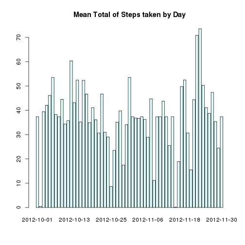

Report 
======

The following Document is a Report that Respond the Questions associated to the basic anaylisis of certain Data containing: Steps done by an individual in the Dates covered between 2012-10-01 and 2010-11-30 in intervals of 5 minutos of aggregated time.

Previously we need to read the data and then tranform it in order to work properly with 
an adequated data frame, Thus, We use the function read.csv and data.framne correspondly..

# I. Read Data and Transform it


```r
# I. Read Data
setwd('/home/jmendez/reproducibleR')
activity=read.csv('activity.csv',header=TRUE,sep=',',na.string='NA')

# Establish Data Structure  
myacti=activity[activity$interval==0,]
mydays=as.character(myacti$date)
myinterv=as.character(activity$interval[1:288])
mymat=matrix(data=activity$steps,nrow=288,ncol=61,dimnames=list(myinterv,mydays))
actdf = data.frame(mymat)
head(actdf)
```

```
##    X2012.10.01 X2012.10.02 X2012.10.03 X2012.10.04 X2012.10.05 X2012.10.06
## 0           NA           0           0          47           0           0
## 5           NA           0           0           0           0           0
## 10          NA           0           0           0           0           0
## 15          NA           0           0           0           0           0
## 20          NA           0           0           0           0           0
## 25          NA           0           0           0           0           0
##    X2012.10.07 X2012.10.08 X2012.10.09 X2012.10.10 X2012.10.11 X2012.10.12
## 0            0          NA           0          34           0           0
## 5            0          NA           0          18           0           0
## 10           0          NA           0           7           0           0
## 15           0          NA           0           0           8           0
## 20           0          NA           0           0           0           0
## 25           0          NA          13           0           0           0
##    X2012.10.13 X2012.10.14 X2012.10.15 X2012.10.16 X2012.10.17 X2012.10.18
## 0            0           0           0           0           0           0
## 5            0           0           0           0           0           0
## 10           0           0           0           0           0           0
## 15           0           0           0           0           0           0
## 20           0           0           0           0           0           0
## 25           0          52          35           0           0          11
##    X2012.10.19 X2012.10.20 X2012.10.21 X2012.10.22 X2012.10.23 X2012.10.24
## 0            0           0           0          10           0           0
## 5            0           0           0           0           0           0
## 10           0           0           0           0           0           0
## 15           0           0           0           0           0           0
## 20           0           0           0           0           4           0
## 25           0           0           0           0           0           0
##    X2012.10.25 X2012.10.26 X2012.10.27 X2012.10.28 X2012.10.29 X2012.10.30
## 0            0           0           0           0           0           0
## 5            0           0           0           0           0           0
## 10           0           0           0           0           0           0
## 15           0           0           0           0           0           0
## 20           0           0           0           0           0           0
## 25           0           0           0           0           0           0
##    X2012.10.31 X2012.11.01 X2012.11.02 X2012.11.03 X2012.11.04 X2012.11.05
## 0            0          NA           0           0          NA           0
## 5            0          NA           0           0          NA           0
## 10           0          NA           0           0          NA           0
## 15           0          NA           0           0          NA           0
## 20           0          NA           0           0          NA           0
## 25           0          NA           0           0          NA           0
##    X2012.11.06 X2012.11.07 X2012.11.08 X2012.11.09 X2012.11.10 X2012.11.11
## 0            0           0           0          NA          NA           0
## 5            0           0           0          NA          NA           0
## 10           0           0           0          NA          NA           0
## 15           0           0           0          NA          NA           0
## 20           0           0           0          NA          NA           0
## 25           0           0           0          NA          NA           0
##    X2012.11.12 X2012.11.13 X2012.11.14 X2012.11.15 X2012.11.16 X2012.11.17
## 0            0           0          NA           0           0           0
## 5            0           0          NA           0           0           0
## 10           0           0          NA           0           0           0
## 15           0           0          NA           0           0           0
## 20           0           0          NA           0           0           0
## 25           0           0          NA           0           0           0
##    X2012.11.18 X2012.11.19 X2012.11.20 X2012.11.21 X2012.11.22 X2012.11.23
## 0            0           0           0           0           0           0
## 5            0           0           0           0           0           0
## 10           0           0           0           0           0           0
## 15           0           0           0           0           0           0
## 20           0           0           0           0           0           0
## 25           0           0           0           0           0           0
##    X2012.11.24 X2012.11.25 X2012.11.26 X2012.11.27 X2012.11.28 X2012.11.29
## 0            0           0           0           0           0           0
## 5            0           0           0           0           0           0
## 10           0           0           0           0           0           0
## 15           0           0           0           0           0           0
## 20           0           0           0           0           0           0
## 25           0           0           0           0           0           0
##    X2012.11.30
## 0           NA
## 5           NA
## 10          NA
## 15          NA
## 20          NA
## 25          NA
```

###Then we will expose the questions and the answers using explicit text ang plot to support that.

#  II.-  What is mean total number of steps taken per day ?

### For this part of the assignment, you can ignore the missing values in the dataset.

## 1. Calculate the total number of steps taken per day

## Total 


```r
totStepsDays=lapply(actdf,sum)
barplot(as.numeric(totStepsDays),names.arg=mydays,main='Mean Total Number of Steps taken per day',col='lightblue')
```

 

## 2. If you do not understand the difference between a histogram and a barplot, research the difference between them. Make a histogram of the total number of steps taken each day

## Histogram


```r
hist(as.numeric(totStepsDays),breaks=40,col='lightgreen',main='Histogram of Steps per Day',xlab='TotalStepsPerDays')  
```

 

###Histogram points to the probability distribution function

## 3. Calculate and report the mean and median of the total number of steps taken per day

## Mean


```r
meanStepsDays=lapply(actdf,mean)
barplot(as.numeric(meanStepsDays),names.arg=mydays,main='Mean Total of Steps taken by Day',col='lightcyan')
```

 

##Median


```r
medianStepsDays=lapply(actdf,median)
barplot(as.numeric(medianStepsDays),names.arg=mydays,main='Median Total of Steps by Day')
```

 

# III.- What is the average daily activity pattern?

## Make a time series plot (i.e. type = "l") of the 5-minute interval (x-axis) and  the average number of steps taken, averaged across all days (y-axis)
### Just and exploring data exercise...

```r
# Just exploring the data...
plot(rownames(actdf), actdf$X2012.10.10,type='l',col='red',main='Steps by Interval for different days',ylab='Steps', xlab='Intervals')
points(rownames(actdf), actdf$X2012.10.11,type='l',col='orange')
points(rownames(actdf), actdf$X2012.10.12,type='l',col='yellow')
points(rownames(actdf), actdf$X2012.10.13,type='l',col='green')
points(rownames(actdf), actdf$X2012.10.14,type='l',col='blue')
points(rownames(actdf), actdf$X2012.10.15,type='l',col='violet')
points(rownames(actdf), actdf$X2012.10.16,type='l',col='orange')
points(rownames(actdf), actdf$X2012.10.17,type='l',col='yellow')
points(rownames(actdf), actdf$X2012.10.18,type='l',col='green')
points(rownames(actdf), actdf$X2012.10.19,type='l',col='blue')
points(rownames(actdf), actdf$X2012.10.20,type='l',col='violet')
```

 

```r
#
```

##  Means Steps by Interval 


```r
meanStepsInterv=apply(actdf,1,function(x)mean(x[!is.na(x)]))
# correspondly Plot the average of steps across all days 
plot(rownames(actdf), meanStepsInterv,type='l',col='red',main='Mean Steps by Interval across all days',ylab='Steps', xlab='Intervals')
```

 

## Which 5-minute interval, on average across all the days in the dataset, 


```r
#   contains the maximum number of steps?
max=0; for(i in 1:288) if(meanStepsInterv[i]>max) { max=meanStepsInterv[i];print(paste(i," ",max)) }
```

```
## [1] "1   1.71698113207547"
## [1] "6   2.09433962264151"
## [1] "51   2.56603773584906"
## [1] "55   4.11320754716981"
## [1] "68   6.05660377358491"
## [1] "69   16.0188679245283"
## [1] "70   18.3396226415094"
## [1] "71   39.4528301886792"
## [1] "72   44.4905660377358"
## [1] "74   49.2641509433962"
## [1] "75   53.7735849056604"
## [1] "76   63.4528301886792"
## [1] "94   69.5471698113208"
## [1] "97   73.377358490566"
## [1] "99   129.433962264151"
## [1] "100   157.528301886792"
## [1] "101   171.150943396226"
## [1] "103   177.301886792453"
## [1] "104   206.169811320755"
```

```r
## interval 104   correspond to 206.16 the max
summary(meanStepsInterv)
```

```
##    Min. 1st Qu.  Median    Mean 3rd Qu.    Max. 
##   0.000   2.486  34.110  37.380  52.830 206.200
```
##Answ: Interval 104

#  IV.- Imputing missing values

###Note that there are a number of days/intervals where there are missing values (coded as NA). The presence of missing days may introduce bias into some calculations or summaries of the data.

## 1. Calculate and report the total number of missing values in the dataset (i.e. the total number of rows with NAs) Total


```r
missValues=sum(is.na(actdf))
missValues
```

```
## [1] 2304
```

```r
#per row
apply(actdf,1,function(x)sum(is.na(x)))
```

```
##    0    5   10   15   20   25   30   35   40   45   50   55  100  105  110 
##    8    8    8    8    8    8    8    8    8    8    8    8    8    8    8 
##  115  120  125  130  135  140  145  150  155  200  205  210  215  220  225 
##    8    8    8    8    8    8    8    8    8    8    8    8    8    8    8 
##  230  235  240  245  250  255  300  305  310  315  320  325  330  335  340 
##    8    8    8    8    8    8    8    8    8    8    8    8    8    8    8 
##  345  350  355  400  405  410  415  420  425  430  435  440  445  450  455 
##    8    8    8    8    8    8    8    8    8    8    8    8    8    8    8 
##  500  505  510  515  520  525  530  535  540  545  550  555  600  605  610 
##    8    8    8    8    8    8    8    8    8    8    8    8    8    8    8 
##  615  620  625  630  635  640  645  650  655  700  705  710  715  720  725 
##    8    8    8    8    8    8    8    8    8    8    8    8    8    8    8 
##  730  735  740  745  750  755  800  805  810  815  820  825  830  835  840 
##    8    8    8    8    8    8    8    8    8    8    8    8    8    8    8 
##  845  850  855  900  905  910  915  920  925  930  935  940  945  950  955 
##    8    8    8    8    8    8    8    8    8    8    8    8    8    8    8 
## 1000 1005 1010 1015 1020 1025 1030 1035 1040 1045 1050 1055 1100 1105 1110 
##    8    8    8    8    8    8    8    8    8    8    8    8    8    8    8 
## 1115 1120 1125 1130 1135 1140 1145 1150 1155 1200 1205 1210 1215 1220 1225 
##    8    8    8    8    8    8    8    8    8    8    8    8    8    8    8 
## 1230 1235 1240 1245 1250 1255 1300 1305 1310 1315 1320 1325 1330 1335 1340 
##    8    8    8    8    8    8    8    8    8    8    8    8    8    8    8 
## 1345 1350 1355 1400 1405 1410 1415 1420 1425 1430 1435 1440 1445 1450 1455 
##    8    8    8    8    8    8    8    8    8    8    8    8    8    8    8 
## 1500 1505 1510 1515 1520 1525 1530 1535 1540 1545 1550 1555 1600 1605 1610 
##    8    8    8    8    8    8    8    8    8    8    8    8    8    8    8 
## 1615 1620 1625 1630 1635 1640 1645 1650 1655 1700 1705 1710 1715 1720 1725 
##    8    8    8    8    8    8    8    8    8    8    8    8    8    8    8 
## 1730 1735 1740 1745 1750 1755 1800 1805 1810 1815 1820 1825 1830 1835 1840 
##    8    8    8    8    8    8    8    8    8    8    8    8    8    8    8 
## 1845 1850 1855 1900 1905 1910 1915 1920 1925 1930 1935 1940 1945 1950 1955 
##    8    8    8    8    8    8    8    8    8    8    8    8    8    8    8 
## 2000 2005 2010 2015 2020 2025 2030 2035 2040 2045 2050 2055 2100 2105 2110 
##    8    8    8    8    8    8    8    8    8    8    8    8    8    8    8 
## 2115 2120 2125 2130 2135 2140 2145 2150 2155 2200 2205 2210 2215 2220 2225 
##    8    8    8    8    8    8    8    8    8    8    8    8    8    8    8 
## 2230 2235 2240 2245 2250 2255 2300 2305 2310 2315 2320 2325 2330 2335 2340 
##    8    8    8    8    8    8    8    8    8    8    8    8    8    8    8 
## 2345 2350 2355 
##    8    8    8
```

```r
#per col
sapply(actdf,function(x)sum(is.na(x)))
```

```
## X2012.10.01 X2012.10.02 X2012.10.03 X2012.10.04 X2012.10.05 X2012.10.06 
##         288           0           0           0           0           0 
## X2012.10.07 X2012.10.08 X2012.10.09 X2012.10.10 X2012.10.11 X2012.10.12 
##           0         288           0           0           0           0 
## X2012.10.13 X2012.10.14 X2012.10.15 X2012.10.16 X2012.10.17 X2012.10.18 
##           0           0           0           0           0           0 
## X2012.10.19 X2012.10.20 X2012.10.21 X2012.10.22 X2012.10.23 X2012.10.24 
##           0           0           0           0           0           0 
## X2012.10.25 X2012.10.26 X2012.10.27 X2012.10.28 X2012.10.29 X2012.10.30 
##           0           0           0           0           0           0 
## X2012.10.31 X2012.11.01 X2012.11.02 X2012.11.03 X2012.11.04 X2012.11.05 
##           0         288           0           0         288           0 
## X2012.11.06 X2012.11.07 X2012.11.08 X2012.11.09 X2012.11.10 X2012.11.11 
##           0           0           0         288         288           0 
## X2012.11.12 X2012.11.13 X2012.11.14 X2012.11.15 X2012.11.16 X2012.11.17 
##           0           0         288           0           0           0 
## X2012.11.18 X2012.11.19 X2012.11.20 X2012.11.21 X2012.11.22 X2012.11.23 
##           0           0           0           0           0           0 
## X2012.11.24 X2012.11.25 X2012.11.26 X2012.11.27 X2012.11.28 X2012.11.29 
##           0           0           0           0           0           0 
## X2012.11.30 
##         288
```

### That show that the NA correpond to complete days in our cases columns: X2012.10.01, X2012.10.08, x2012.11.01, X2012.11.04, X2012.11.09, X2012.11.10, X2012.11.14, X2012.11.30  (8)

 
## 2.- Devise a strategy for filling in all of the missing values in the dataset. The strategy does not need to be sophisticated. For example, you could use the mean/median for that day, or the mean for that 5-minute interval, etc.
## I used the Rows means because the columns were affected i used meanStepsInterval substituing NA columns
##  Answ: I will change that columns by the means Row Average:   meanStepsInterv[i]


## 3.- Create a new dataset that is equal to the original dataset but with the missing data filled in.


```r
actdf=transform(actdf,X2012.10.01=meanStepsInterv)
actdf=transform(actdf,X2012.10.08=meanStepsInterv)
actdf=transform(actdf,X2012.11.01=meanStepsInterv)
actdf=transform(actdf,X2012.11.04=meanStepsInterv)
actdf=transform(actdf,X2012.11.09=meanStepsInterv)
actdf=transform(actdf,X2012.11.10=meanStepsInterv)
actdf=transform(actdf,X2012.11.14=meanStepsInterv)
actdf=transform(actdf,X2012.11.30=meanStepsInterv)
# Checking not NA, or emplty values
missValues2=sum(is.na(actdf))
missValues2
```

```
## [1] 0
```

## 4.- Make a histogram of the total number of steps taken each day and Calculate and report the mean and median total number of steps taken per day. Do these values differ from the estimates from the first part of the assignment? What is the impact of imputing missing data on the estimates of the total daily number of steps?

## BarPlot & Histogram with NA consideration

## Barplot handling NA


```r
totStepsDays2=lapply(actdf,sum)
barplot(as.numeric(totStepsDays2),names.arg=mydays,main='Mean Total Number of Steps taken per day',col='lightblue')
```

 
## Histogram handling NA


```r
hist(as.numeric(totStepsDays2),breaks=40,col='lightblue',main='Histogram of Steps per Day',xlab='TotalStepsPerDays') 
```

 

## Mean handling NA


```r
meanStepsDays2=lapply(actdf,mean)
barplot(as.numeric(meanStepsDays2),names.arg=mydays,main='Mean Total of Steps taken by Day',col='lightcyan')
```

 

## Median handling NA


```r
medianStepsDays2=lapply(actdf,median)
barplot(as.numeric(medianStepsDays2),names.arg=mydays,main='Median Total of Steps by Day')
```

 

## Are there differences in activity patterns between weekdays and weekends?
## Answ: Yes of course, the differents graphs expose that, Median no zero, different grapg centroid and graph Area below the curve. A different histogram center or media,all these aspects were affected. The result is sensible to the NA elements.


```r
myday0=substr(colnames(actdf),2,11)
```

## 1. Create a new factor variable in the dataset with two levels – “weekday” and “weekend” indicating whether a given date is a weekday or weekend day.


```r
weekf=weekdays(as.Date(myday0,"%Y.%m.%d"))
for(i in 1:61) if(weekf[i]=="Sunday"||weekf[i]=="Saturday") weekf[i]='weekend' else weekf[i]='weekday'
actdf2=rbind(actdf,weekf)
```

## in my case correspond to a new row

## 2. Make a panel plot containing a time series plot (i.e. type = "l") of the 5-minute interval (x-axis) and the average number of steps taken, averaged across all weekday days or weekend days (y-axis).


```r
actweekenddf=actdf2[,actdf2[289,]=='weekend']
actweekdaydf=actdf2[,actdf2[289,]=='weekday']

actweekendf=apply(actweekenddf[1:288,],1,function(x)mean(as.numeric(x)))
actweekdayf=apply(actweekdaydf[1:288,],1,function(x)mean(as.numeric(x)))

par(mfrow=c(2,1))
plot(names(actweekendf),actweekendf,type='l',main='Weekend',xlab='',ylab='Steps',xlim=c(0,2400))
plot(names(actweekdayf),actweekdayf,type='l',main='Weekday',xlab='Intervals',ylab='Steps',xlim=c(0,2400))
```

 

```r
par(mfrow=c(1,1))
```

### Reference:
This is an R Markdown document. Markdown is a simple formatting syntax for authoring HTML, PDF, and MS Word documents. For more details on using R Markdown see <http://rmarkdown.rstudio.com>.

When you click the **Knit** button a document will be generated that includes both content as well as the output of any embedded R code chunks within the document. You can embed an R code chunk like this:


